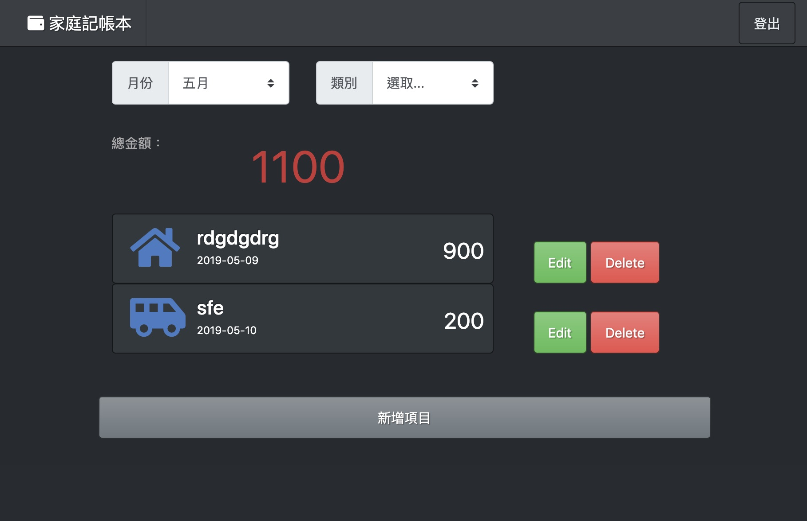

# 家庭記帳本 :wink:
---

---

### **User Stories**
- [ ] 使用者可以用 email 註冊，註冊時必須指定使用者名稱
- [ ] 登入後，使用者可以：
- [ ] 在首頁瀏覽自己的支出記錄
- [ ] 在首頁看到自己的支出總金額
- [ ] 新增一筆支出
- [ ] 編輯特定一筆支出的內容
- [ ] 刪除特定一筆支出
- [ ] 可以透過 Facebook 帳號登入
- [ ] 在首頁瀏覽支出記錄時，可以篩選類別與日期，並看到篩選後的總金額

**MySQL操作**

npx sequelize init

npx sequelize model:generate --name Record --attributes name:string,category:string,date:string,amount:string

npx sequelize db:migrate

npx sequelize model:generate --name User --attributes name:string,email:string,password:string

npx sequelize db:migrate

npx sequelize migration:generate --name add-userId-to-record

**MySQL workbench 指令**

drop database if exists expanse_sequelize;
create database expanse_sequelize;
use expanse_sequelize;
select * from records;
select * from users;